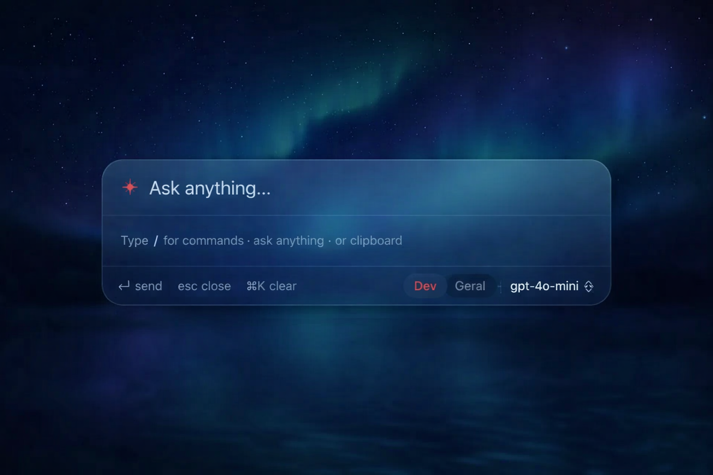
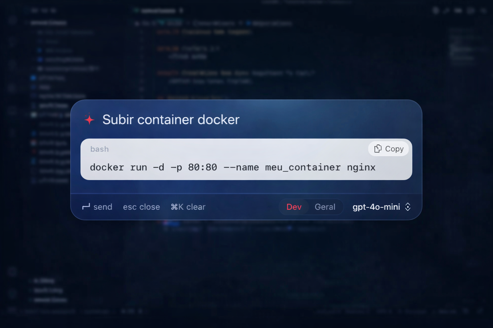

# Aura for macOS

A minimal, keyboard-first AI launcher. Press **Option+Space** from anywhere to get instant AI assistance.

<p align="center">
  
  <br><br>
  
</p>

## Features

- **Global hotkey** (Option+Space) — opens and closes from any app
- **AI chat** — streaming responses via OpenAI or any OpenAI-compatible endpoint (Ollama, LM Studio)
- **Command modes** — `/translate`, `/fix`, `/explain`, `/summarize`, `/code`, `/shorter`
- **Calculator & currency converter** — `2 + 2`, `100 USD to BRL`
- **Clipboard history** — ⌘⇧V shows the last 50 copied items
- **Markdown rendering** — code blocks, lists, inline code
- **Glassmorphic UI** — adapts to light and dark mode

## Shortcuts

| Shortcut | Action |
|---|---|
| `Option+Space` | Toggle panel |
| `Enter` | Send message |
| `Esc` | Close panel |
| `⌘K` | Clear conversation |
| `⌘⇧V` | Clipboard history |
| `↑ / ↓` | Navigate input history |

## Installation

```bash
git clone https://github.com/your-username/aura.git
cd aura/Aura
./run.sh        # build, sign & launch
```

For a distributable DMG: `./build-dmg.sh`

## Requirements

- macOS 14 (Sonoma)+
- OpenAI API key **or** local LLM via [Ollama](https://ollama.com)

## License

[MIT](../LICENSE)
